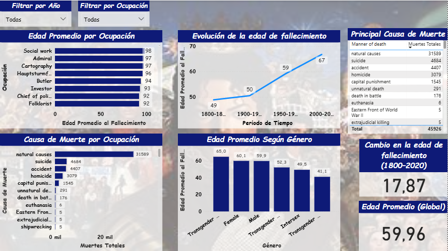

# 📊 Factores que influyen en la edad de fallecimiento de personas famosas

## 📌 Descripción del proyecto

Este proyecto analiza cómo diferentes factores como la **ocupación**, el **género**, el **periodo histórico** y la **causa de muerte** influyen en la **edad de fallecimiento** de personas famosas y figuras históricamente relevantes.

Se desarrolló un **dashboard interactivo en Power BI** utilizando un conjunto de datos real que contiene **1.22 millones de personas**. Para el análisis se trabajó con un subconjunto de **45.930 registros**, correspondiente a personas fallecidas entre los años **1800 y 2020**, lo que permitió obtener resultados comparables y confiables.

El objetivo principal es identificar si existen diferencias significativas en la edad de fallecimiento según distintas variables.

---

## 🎯 Problemática

**¿Existen diferencias significativas en la edad de fallecimiento de personas famosas según su ocupación, género y causa de muerte entre los años 1800 y 2020?**

---

## 🧠 Hipótesis

- La edad promedio de fallecimiento varía según la ocupación.  
- Existen diferencias en la edad de fallecimiento según el género.  
- La edad de fallecimiento ha aumentado con el tiempo.  
- El tipo de ocupación influye en la causa de muerte.

---

## 🗂 Conjunto de datos

**Fuente:** Kaggle – *Age Dataset: Life, Work, and Death of 1.22M People*
https://www.kaggle.com/datasets/isaac09/age-dataset-life-work-and-death-of-1-22m-people

El dataset contiene información estructurada sobre **1.22 millones de personas famosas o históricamente relevantes** que ya han fallecido, incluyendo datos sobre su vida, profesión y fallecimiento.

Fue construido a partir de información de **Wikidata y Wikipedia en múltiples idiomas**, lo que permite analizar patrones históricos de mortalidad en diferentes contextos sociales y profesionales.

---

## 🗂 Columnas del dataset

El archivo original contiene 10 columnas, entre ellas: **Id, Name, Gender, Country, Occupation, Birth year, Death year, Manner of death y Age of death**.

Para este proyecto se utilizaron únicamente las siguientes variables necesarias para el análisis:

- Id
- Gender
- Occupation
- Death year
- Manner of death
- Age of death

Aunque el dataset original incluye **1.22 millones de personas**, tras aplicar filtros de calidad y periodo histórico se trabajó con **45,930 registros** correspondientes a personas fallecidas entre **1800 y 2020**, lo que permitió un análisis más consistente y comparable.

---

## 🧹 Limpieza y preparación de datos

Se realizaron los siguientes procesos de limpieza y transformación en Power BI (Power Query) para asegurar la calidad y consistencia de los datos analizados:

### 📅 Filtro temporal
- `Death year ≥ 1800`
- `Death year ≤ 2020`

Esto permitió eliminar datos demasiado antiguos o fuera del periodo de estudio, así como valores anómalos que no eran comparables.

### 🧩 Eliminación de columnas innecesarias

Para optimizar el modelo y enfocarlo en la problemática, se eliminaron las siguientes columnas que no eran relevantes para el análisis:

- Country
- Short description
- Name
- Birth year

### 🚫 Tratamiento de valores nulos

Se eliminaron las filas que contenían valores nulos en:

- Gender 
- Occupation
  
ya que estas variables eran fundamentales para responder las hipótesis del proyecto.

## 🧱 Columna calculada

Se creó una columna llamada Periodo para agrupar los años de fallecimiento en bloques históricos, facilitando el análisis temporal:

```DAX
Periodo =
IF([Death year] < 1900, "1800–1899",
IF([Death year] < 1950, "1900–1949",
IF([Death year] < 2000, "1950–1999", "2000–2020")))
```
Esta transformación permitió analizar la evolución de la edad de fallecimiento a lo largo del tiempo.

## 📐 Medidas DAX

Para responder a la problemática del proyecto y analizar cómo varía la edad de fallecimiento según el periodo histórico, se crearon las siguientes medidas en DAX.

```DAX
Edad Promedio al Fallecimiento = 
AVERAGE('AgeDataset-V1'[Age of death])
```
### ¿Para qué sirve?
Calcula la edad promedio a la que fallecen las personas dentro del conjunto de datos.

```DAX
Muertes Totales = 
COUNT('AgeDataset-V1'[Id])
```

### ¿Para qué sirve?
Cuenta cuántas personas (registros) están siendo analizadas. Permite saber el tamaño de la muestra.

```DAX
Edad 1800 = 
CALCULATE([Edad Promedio al Fallecimiento], 'AgeDataset-V1'[Periodo] = "1800–1899")
```

### ¿Para qué sirve?
Calcula la edad promedio al fallecer únicamente para las personas que murieron entre 1800 y 1899.

```DAX
Edad 2000 = 
CALCULATE([Edad Promedio al Fallecimiento], 'AgeDataset-V1'[Periodo] = "2000–2020")
```

### ¿Para qué sirve?
Calcula la edad promedio al fallecer para quienes murieron entre 2000 y 2020, representando la época más reciente del análisis.

```DAX
Diferencia Edad = 
[Edad 2000] - [Edad 1800]
```
### ¿Para qué sirve?
Mide cuánto ha cambiado la edad promedio de fallecimiento entre el siglo XIX y la época moderna.

---

## 📊 Visualizaciones del dashboard

### 1️⃣ Edad promedio por ocupación
- Gráfico de barras
- Permite identificar qué profesiones viven más o menos en promedio.

### 2️⃣ Evolución de la edad de fallecimiento
- Gráfico de líneas por periodo
- Muestra cómo la edad promedio ha aumentado con el tiempo.

### 3️⃣ Edad promedio según género
- Gráfico de columnas
- Compara hombres, mujeres y otros géneros.

### 4️⃣ Causa de muerte por ocupación
- Gráfico de barras
- Permite ver cómo cambia la causa de muerte según el tipo de profesión.

### 5️⃣ KPIs
- Edad promedio global
- Diferencia entre 1800–1899 y 2000–2020
- Causa de muerte más frecuente

---

## 📌 Resultados clave

- La edad promedio de fallecimiento sí varía según la ocupación.
- Existen diferencias claras por género, siendo las mujeres quienes presentan mayor edad promedio.
- La edad de fallecimiento aumentó significativamente entre 1800 y 2020.
- La ocupación influye en la causa de muerte, por ejemplo:
-  Políticos muestran más homicidios.
-  Artistas presentan mayor proporción de causas naturales.

---

## 🧠 Conclusiones

Este análisis demuestra que factores sociales y profesionales tienen una relación directa con la longevidad (edad al fallecer) de las personas famosas.

El uso de Power BI, junto con una correcta limpieza de datos y el uso de medidas DAX, permitió construir un dashboard interactivo que facilita la exploración de patrones históricos en más de dos siglos de datos.

Este proyecto refleja habilidades reales de:

- Análisis exploratorio
- Modelado de datos
- Visualización
- Pensamiento analítico

## 🔗 Dashboard interactivo

Haz clic en la imagen para ver el dashboard interactivo en Power BI:

[](https://app.powerbi.com/view?r=eyJrIjoiYThkOGI1MWMtNmE0Ni00ZTU3LWI4N2EtNWQ2NWE1ZmViMjgwIiwidCI6IjI5OWEyODgxLTEzODAtNDAyMC1iNDJmLTcxNWEzNWUxYmNhZiIsImMiOjR9)
